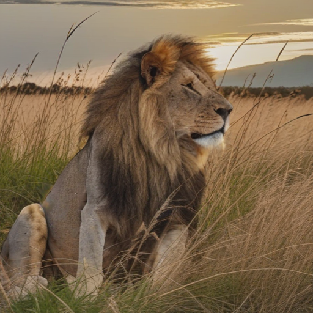
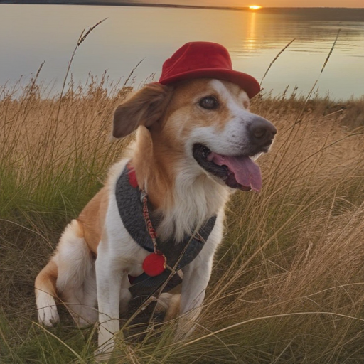
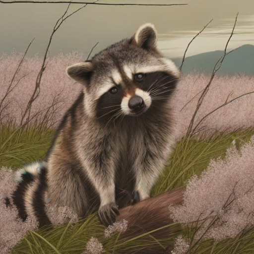

See [original GNRI repository](https://github.com/dvirsamuel/NewtonRaphsonInversion). 

# Editing Images using Text
Observe the similar pose of the foreground animal and background of two images. 

|"a lion is sitting in the grass at sunset"|"a dog with a funny red hat is sitting in the grass at sunset"|"a raccoon sitting in a field of cherry blossoms, photorealistic"|
|---|---|---|
||||

# My Changes
* Fixed various errors to get `ReadlTimeEditingNotebook.ipynb` working (import, device errors)
* Fixed CFG error allowing guidance scale > 1.0
* Fixed inversion not actually inverting to the final timestep (this may be an SDXL-specific thing)
* Additionally separated inversion/ inference to two GPU's because mine aren't large enough to fit SDXL on one GPU
* Implemented DDIM Scheduler in addition to Euler Scheduler
